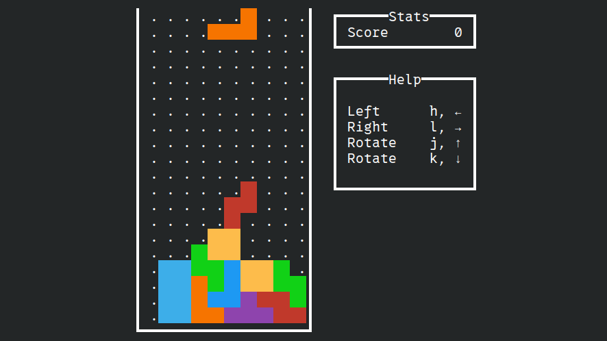
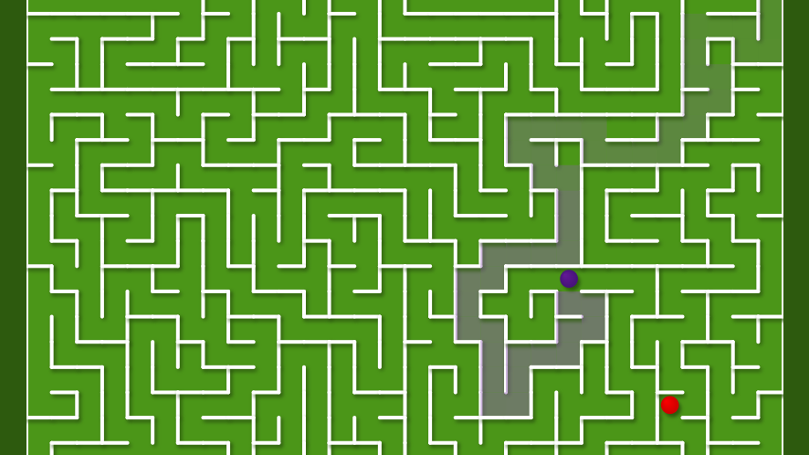
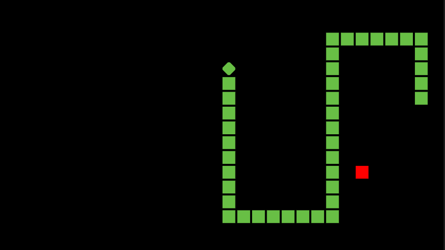
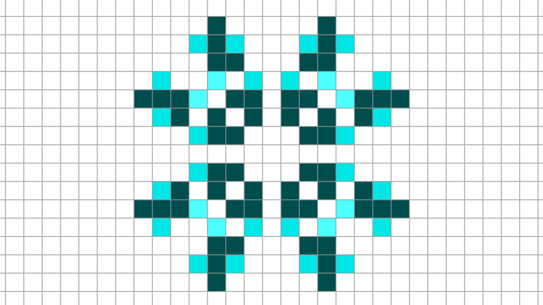
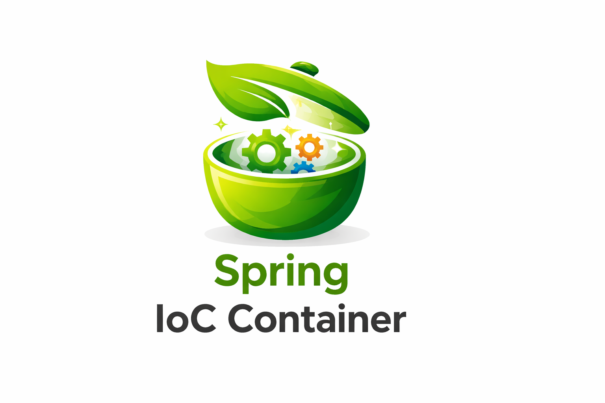

  

<h1 style="text-align: center;"> Hi, I'm Jaikaran 👋</h1>

 <em> Java Backend Developer passionate about building scalable, high-performance backend systems with Java, Spring Boot, Microservices, and cloud technologies. </em> 

## 🎓 Education

**Bachelor of Technology in Computer Science**  
*2019-2023*

## 🚀 projects

<table>
<tr>
<td width="100%" onclick="window.location.href='https://github.com/jaikarans/tetris-for-terminal'" style="cursor:pointer;">

<h3>Tetris for Terminal</h3>
A classic Tetris game playable entirely in the terminal, written in Java
</td>
</tr>

<tr>
<td width="100%" onclick="window.location.href='https://github.com/jaikarans/maze-game'" style="cursor:pointer;">

<h3>Maze Game</h3>
A responsive maze game that adapts seamlessly to different screen sizes
</td>
</tr>

<tr>
<td width="100%" onclick="window.location.href='https://github.com/jaikarans/snake-xenzia'" style="cursor:pointer;">

<h3>Snake Xenzia</h3>
An implementation of the classic Snake game designed for Pc and Laptop
</td>
</tr>

<tr>
<td width="100%" onclick="window.location.href='https://github.com/jaikarans/game-of-life'" style="cursor:pointer;">

<h3>Game Of Life</h3>
An implementation of Conway's Game of Life, a cellular automaton
</td>
</tr>
</table>

 

## ✍️ Blog

I write technical blogs to document my learning journey, explain core computer science concepts, and share hands-on experiences from the projects I build.  
My focus is on **Java, Spring Framework, and software design principles**, explained in a simple and practical way.

### 📌 Featured Posts

<table>
<tr>
<td width="50%" onclick="window.location.href='https://medium.com/@jaikrns/inversion-of-control-ioc-spring-framework-core-eef63cd168f2'" style="cursor:pointer;">

<h3>Inversion of Control (IoC) Spring Framework Core</h3>
Explains what IoC really means, why it exists, and how Spring manages object creation and lifecycle.
</td>
<!-- <td width="50%">
</td> -->
<td width="50%" onclick="window.location.href='https://medium.com/@jaikrns/everything-about-fail-fast-and-fail-safe-iterators-d81400304ed2'" style="cursor:pointer;">

<h3>Everything About Fail-fast and Fail-safe Iterators</h3>
Master Java Collection iterators by understanding Fail-Fast and Fail-Safe behaviour.
</td>
</tr>

</table>

